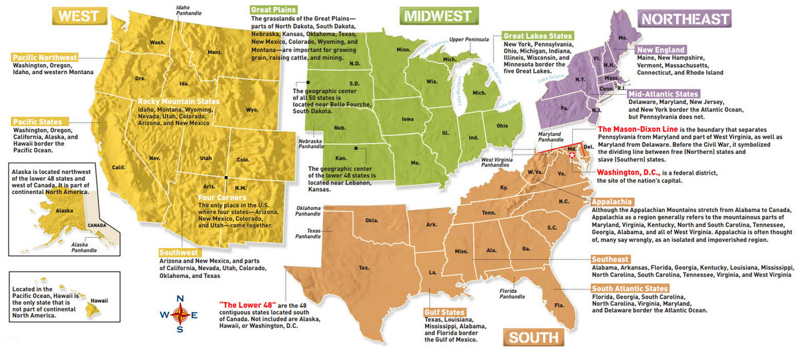
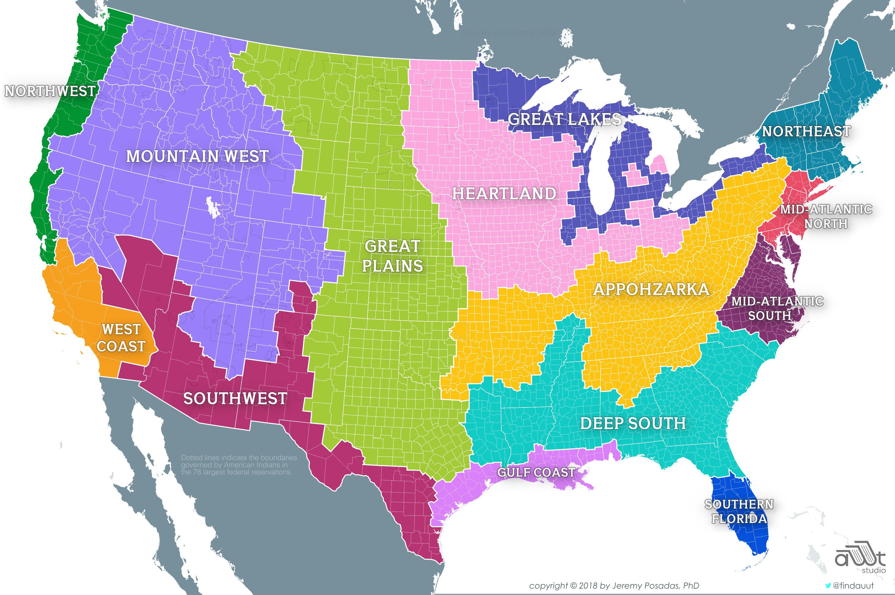

# Index for: REGIONS 🗺️

[🏚️](../README.md)

Here you will find links to all the other documents in this folder. This category lists regions of the United States (USA) and subregions.

We will generally use the regions defined at [https://www.ducksters.com/geography/us_states/us_geographical_regions.php](https://www.ducksters.com/geography/us_states/us_geographical_regions.php):

## Major Regions

<figure>
  
  <figcaption>US Regions map from <a href="https://vividmaps.com/regions-united-states/" target="_blank">VividMaps.com</a></figcaption>
</figure>

### Northeast

- **States included:** Maine, Massachusetts, Rhode Island, Connecticut, New Hampshire, Vermont, New York, Pennsylvania, New Jersey, Delaware, Maryland
- **Climate:** Humid continental climate with cool summers in the northernmost areas. Snow falls during the winter as the temperatures are regularly below freezing.
- **Major geographical features:** Appalachian Mountains, Atlantic Ocean, Great Lakes, borders on Canada to the north

### Southeast

- **States included:** West Virginia, Virginia, Kentucky, Tennessee, North Carolina, South Carolina, Georgia, Alabama, Mississippi, Arkansas, Louisiana, Florida
- **Climate:** Humid subtropical climate with hot summers. Hurricanes can reach landfall in the summer and fall months along the Atlantic and Gulf coasts.
- **Major geographical features:** Appalachian Mountains, Atlantic Ocean, Gulf of Mexico, Mississippi River

### Midwest

- States included: Ohio, Indiana, Michigan, Illinois, Missouri, Wisconsin, Minnesota, Iowa, Kansas, Nebraska, South Dakota, North Dakota
- **Climate**: Humid continental climate throughout most of the region. Snow is common during the winter, especially in the northern areas.
- **Major geographical features**: Great Lakes, Great Plains, Mississippi River, borders Canada to the north

### Southwest

- **States included**: Texas, Oklahoma, New Mexico, Arizona
- **Climate**: Semiarid Steppe climate in the western area with a more humid climate to the east. Some of the far western areas of the region have an alpine or desert climate.
- **Major geographical features**: Rocky Mountains, Colorado River, Grand Canyon, Gulf of Mexico, borders Mexico to the south

### West

- **States included**: Colorado, Wyoming, Montana, Idaho, Washington, Oregon, Utah, Nevada, California, Alaska, Hawaii
- **Climate**: A range of climates including semiarid and alpine along the Rocky and Sierra Mountains. The coastline in California is a Mediterranean climate. Desert climates can be found in Nevada and Southern California.
- **Major geographical features**: Rocky Mountains, Sierra Nevada Mountains, Mohave Desert, Pacific Ocean, borders Canada to the North and Mexico to the south

## Sub-Regions

<figure>
  
  <figcaption>US Sub-Regions map from <a href="https://jeremyposadas.org/regions/" target="_blank">JeremyPosadas.com</a></figcaption>
</figure>

Here are some other sub-regions that are often referred to:

- **Mid-Atlantic** - Virginia, West Virginia, Pennsylvania, Maryland, Delaware, New Jersey
- **Central Plains**: - Iowa, Missouri, Kansas, Nebraska
- **Great Lakes**: - Minnesota, Wisconsin, Illinois, Indiana, Ohio, Michigan
- **New England**: - Maine, Vermont, New Hampshire, Massachusetts, Rhode Island, Connecticut
- **Pacific Northwest**: - Washington, Oregon, Idaho
- **Rocky Mountains**: - Utah, Colorado, New Mexico, Wyoming, Montana

---

**In this Folder:**

## Alabama / Florida / Deep South

### The Millennial Gardener**

- Location: North Carolina 

## California

## Pacific Northwest / Washington / Oregon

## North Carolina

### [The Millennial Gardener](https://www.youtube.com/@TheMillennialGardener)

|                       |                |
| --------------------- | -------------- |
| Location:             | North Carolina |
| Recommended Products: |                |
| Merch:                |                |

